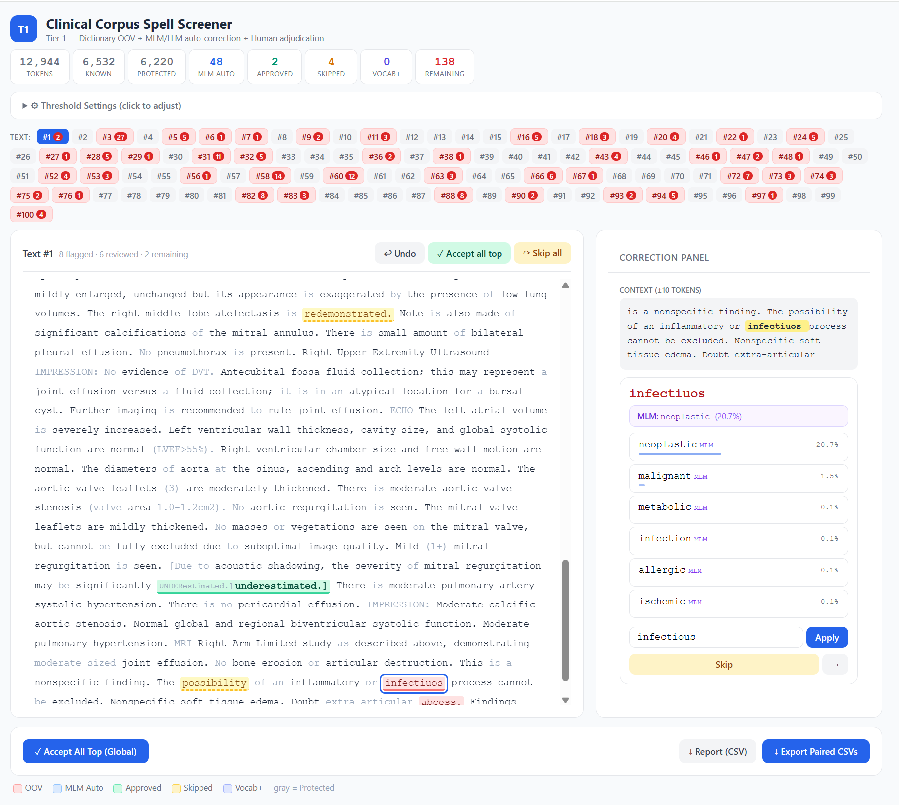

# Clinical Spell Screener

An interactive, browser-based tool for screening and correcting spelling errors in medical and clinical text. Designed for clinical NLP researchers, medical scribes, and anyone working with clinical notes, discharge summaries, or biomedical corpora.



## Background

Built by Anthropic's Claude Opus 4.6, this tool was developed to address a specific problem in clinical NLP training pipelines: when building spell-correction models using synthetic error injection (following NeuSpell/CIM methodology), pre-existing typos in the "clean" corpus create mislabelled training examples. The model gets penalized for correctly fixing a typo that was already in the ground truth.

The screener provides a systematic way to identify and correct these pre-existing errors, producing reliable clean/noisy training pairs. The dictionary + MLM approach is inspired by ClinSpell's contextual validation, adapted for scalable corpus-level screening with human oversight.

Although it was built for clinical text, you can adapt it to text in your domain, by (i) replacing the default language model to one finetuned for your domain, (ii) adapting the guard patterns protecting clinical jargon from being corrected to your domain's jargon. For general English spellchecking, try using ModernBERT as your language model. I haven't tried, so YMMV, DYODD.

**Key features:**

- **Dictionary-based OOV detection** — flags words not found in a 1.5M-entry medical dictionary (UMLS-derived) and clinical abbreviations list
- **AI-assisted correction** — optional masked language model (BioClinical-ModernBERT) scores candidates using calibrated softmax probabilities, not heuristic guesses
- **Human-in-the-loop review** — colour-coded tokens, click-to-correct, context windows, undo, batch operations, and keyboard shortcuts
- **Paired export** — outputs original and corrected text as aligned CSVs, ready for training spell-correction models
- **Runs locally** — your clinical data never leaves your machine

## Quick Start

### Option A: Using uv (Recommended)

[uv](https://docs.astral.sh/uv/) handles Python versions, dependencies, and virtual environments automatically. No pre-existing Python installation required.

```bash
# Install uv (one-time)
# Windows (PowerShell):
powershell -ExecutionPolicy ByPass -c "irm https://astral.sh/uv/install.ps1 | iex"
# Mac/Linux:
curl -LsSf https://astral.sh/uv/install.sh | sh

# Clone the repository
git clone https://github.com/eukairos/clinical-spell-checker.git
cd clinical-spell-screener

# run startup scripts
1. **Double-click** `start_lite.bat` (Windows) or run `./start_lite.sh` (Mac/Linux) for dictionary-only mode
   — or `start.bat` / `./start.sh` for full AI-assisted mode
2. The scripts install `uv` automatically if needed
3. A browser window opens at `http://localhost:8400

```

### Option B: One-Click Launch

1. **Download** this repository (green "Code" button → "Download ZIP") and extract it
2. **Double-click** `start_lite.bat` (Windows) or run `./start_lite.sh` (Mac/Linux) for dictionary-only mode
   — or `start.bat` / `./start.sh` for full AI-assisted mode
3. The scripts install `uv` automatically if needed
4. A browser window opens at `http://localhost:8400`

### Option C: Manual Setup with pip

```bash
git clone https://github.com/eukairos/clinical-spell-screener.git
cd clinical-spell-screener
python -m venv .venv

# Windows: .venv\Scripts\activate
# Mac/Linux: source .venv/bin/activate

pip install -e .                         # Dictionary-only mode
pip install -e ".[mlm]"                   # Full AI-assisted mode

clinical-spell-screener --no-model        # or: python -m screener --no-model
clinical-spell-screener                   # or: python -m screener
```

### Option D: Docker

```bash
docker compose up --build
# Then open http://localhost:8400
```

## How It Works

The tool operates in three phases:

### Phase 1: Dictionary-Based OOV Detection

Every token in your text is checked against a medical dictionary and clinical abbreviations list. Tokens not found in either are flagged as **out-of-vocabulary (OOV)**. Guard patterns protect tokens that should never be flagged: lab values with numbers (`WBC-17.4*`), abbreviations with colons (`HR:`), short tokens (≤2 characters), and other clinical formatting.

### Phase 2: AI-Assisted Scoring (optional)

If the MLM backend is enabled, each OOV token is evaluated by BioClinical-ModernBERT:

1. The token position is **masked** in context and the model predicts what word belongs there
2. Each edit-distance candidate is **scored** using pseudo-log-likelihood (PLL) — the model's calibrated probability for that word in context
3. The original OOV token is also scored — if the model assigns high probability to it, it's likely a valid word the dictionary missed
4. A correction is **auto-applied** only when the best candidate's probability exceeds both the confidence threshold AND the ratio threshold (best ÷ original ≥ 3×)

This two-gate system prevents overcorrection: the model must be both confident in the correction *and* significantly more confident than in the original word.

### Phase 3: Human Review

The browser interface shows your text with colour-coded tokens:

| Colour | Meaning |
|--------|---------|
| 🔴 Red | OOV — needs your decision |
| 🔵 Blue | MLM auto-corrected — review and confirm or revert |
| 🟢 Green | Human-approved correction |
| 🟡 Yellow | Skipped (kept original) |
| 🟣 Purple | Added to vocabulary |
| Grey | Protected (numbers, codes, short tokens) |

Click any flagged token to see its context window, candidate corrections with probability scores, and action buttons. After each action, the cursor auto-advances to the next token needing review.

## What You Need to Provide

The tool requires three input files (uploaded via the browser interface):

### 1. Medical Dictionary (`dictionary_combined.txt`)

A plain text file with one word per line. This is your "known good words" list. The tool comes with scripts to build one from the UMLS Metathesaurus (see the `dictionary/` folder), but you can use any wordlist.

To build from UMLS (requires a free [UMLS license](https://uts.nlm.nih.gov/uts/)):

```bash
cd dictionary
python extract_umls_terms.py --mrconso /path/to/MRCONSO.RRF --output umls_terms.tsv
python build_dictionary.py --umls-terms umls_terms.tsv --output-dir ./output
# Use output/dictionary_combined.txt
```

### 2. Clinical Abbreviations (`dictionary_abbreviations.tsv`)

A TSV file with columns: `abbreviation`, `expansion`, `category`. An example with 483 common clinical abbreviations is included in `docs/dictionary_abbreviations.tsv`. You can add your own institution-specific abbreviations.

### 3. Corpus (`working_sample.csv`)

A CSV file with a single column named `text`, where each row is a clinical note or text segment to screen. An example is included in `examples/working_sample.csv`.

## Outputs

The tool produces several downloadable files:

| File | Description |
|------|-------------|
| `original_corpus.csv` | Your input text, unchanged |
| `corrected_corpus.csv` | Text with all approved corrections applied |
| `screening_report.csv` | Every flagged token with its status, candidates, MLM scores |
| `added_vocabulary.txt` | Words you marked as valid (to merge into your dictionary) |

The original + corrected pair can be used directly as noisy/clean training data for spell-correction models.

## Configuration

### Backend Selection

On the upload screen, choose your backend:

- **MLM Server** (recommended) — uses BioClinical-ModernBERT for calibrated probability scoring. Requires PyTorch + ~4 GB for the model download (first run only).
- **Ollama** — uses a generative LLM (e.g., MedGemma) via a local Ollama instance. Heuristic confidence scoring. Requires [Ollama](https://ollama.ai) running separately.
- **Dictionary Only** — no AI assistance. All OOV tokens are presented for manual review. No GPU or model required.

### Threshold Tuning

During review, click **⚙ Threshold Settings** to adjust:

- **Confidence threshold** (default: 0.30) — minimum softmax probability for auto-correction. Higher = fewer auto-corrections, more manual review.
- **Ratio threshold** (default: 3.0) — the correction's probability must be this many times higher than the original word's probability. Higher = more conservative.

**Tuning guidance:**
- Seeing too many overcorrections? Raise the ratio threshold (try 5.0 or 10.0).
- Model is too conservative and missing obvious typos? Lower the confidence threshold (try 0.15).
- Want to review everything manually? Set confidence threshold to 1.0.

### Using a Custom Model

Any HuggingFace masked language model works:

```bash
python -m screener --model bert-base-uncased          # General English
python -m screener --model dmis-lab/biobert-base-cased-v1.2  # Biomedical
python -m screener --model your-org/your-fine-tuned-model     # Custom
```

## Collaborative Review

For large corpora, multiple reviewers can work in parallel:

1. Each reviewer downloads the same tool and dictionary files
2. On the upload screen, set the **Batch Assignment** text range (e.g., Reviewer A: 1–500, Reviewer B: 501–1000)
3. Each reviewer works independently and exports their corrections
4. Merge the exported CSVs

## Project Structure

```
clinical-spell-screener/
├── pyproject.toml               # Package definition (uv / pip)
├── start.bat / start.sh         # One-click launchers (full mode)
├── start_lite.bat / start_lite.sh  # One-click launchers (dictionary-only)
├── Dockerfile / docker-compose.yml
├── screener/
│   ├── __init__.py
│   ├── __main__.py              # Entry point: python -m screener
│   ├── server.py                # Integrated FastAPI server (UI + API)
│   ├── mlm.py                   # Masked LM model wrapper
│   └── static/
│       └── index.html           # Browser-based review interface
├── dictionary/
│   ├── extract_umls_terms.py    # Build dictionary from UMLS MRCONSO.RRF
│   ├── extract_umls_api.py      # Build dictionary via UMLS REST API
│   ├── build_dictionary.py      # Merge UMLS terms + abbreviations
│   └── clinical_abbreviations.py  # 483 curated clinical abbreviations
└── examples/
    ├── working_sample.csv       # Sample clinical notes
    └── dictionary_abbreviations.tsv  # Example abbreviations file
```

## System Requirements

| Mode | Python | RAM | GPU | Disk |
|------|--------|-----|-----|------|
| Dictionary-only | 3.10–3.13 | 1 GB | Not needed | ~50 MB |
| MLM-assisted (CPU) | 3.10–3.13 | 4 GB | Not needed | ~2 GB |
| MLM-assisted (GPU) | 3.10–3.13 | 4 GB | Any CUDA GPU | ~2 GB |

If using `uv`, Python is managed automatically — you don't need to install it separately.
First-run model download is ~500 MB. Subsequent launches are fast (~5 seconds).

## Keyboard Shortcuts

| Shortcut | Action |
|----------|--------|
| `Ctrl+Z` / `Cmd+Z` | Undo last action |
| `Enter` (in custom field) | Apply custom correction |

## Troubleshooting

**"Python not found"** — Use `uv` (recommended) which manages Python automatically. Or install Python 3.10–3.13 from [python.org](https://www.python.org/downloads/). Avoid Python 3.14 (dependency compatibility issues).

**Model download is slow** — The first run downloads BioClinical-ModernBERT (~500 MB). Subsequent runs use the cached model. If you're behind a proxy, set `HTTPS_PROXY` before running.

**CUDA/GPU errors** — Run in CPU mode: `uv run --extra mlm clinical-spell-screener --device cpu` or use dictionary-only mode: `uv run clinical-spell-screener --no-model`

**Port already in use** — Use a different port: `uv run clinical-spell-screener --port 9000`

**Browser doesn't open** — Manually navigate to `http://localhost:8400`


## Citation

If you use this tool in your research, please cite:

```bibtex
@software{clinical_spell_screener,
  title={Clinical Spell Screener: Interactive Medical Text Spell Screening Tool},
  year={2026},
  url={https://github.com/eukairos/clinical-spell-screener}
}
```
Bioclinical-ModernBERT citation:
```bibtex
@misc{sounack2025bioclinicalmodernbertstateoftheartlongcontext,
      title={BioClinical ModernBERT: A State-of-the-Art Long-Context Encoder for Biomedical and Clinical NLP}, 
      author={Thomas Sounack and Joshua Davis and Brigitte Durieux and Antoine Chaffin and Tom J. Pollard and Eric Lehman and Alistair E. W. Johnson and Matthew McDermott and Tristan Naumann and Charlotta Lindvall},
      year={2025},
      eprint={2506.10896},
      archivePrefix={arXiv},
      primaryClass={cs.CL},
      url={https://arxiv.org/abs/2506.10896}, 
}
```

## License

MIT License. See [LICENSE](LICENSE) for details.

Note: The default model (BioClinical-ModernBERT-base) and any UMLS-derived dictionary data are subject to their own licenses. The UMLS Metathesaurus requires a free license agreement from the [National Library of Medicine](https://uts.nlm.nih.gov/uts/).
